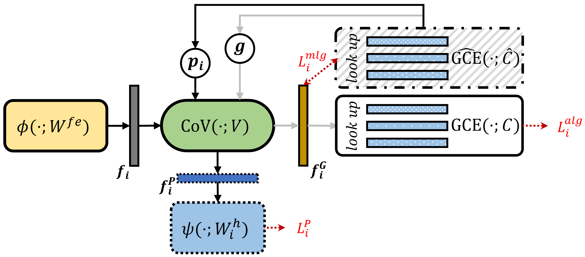

# Introduction

This is the official implementation of our paper [*GPFL: Simultaneously Learning Generic and Personalized Feature Information for Personalized Federated Learning*](https://arxiv.org/pdf/2308.10279.pdf) (accepted by ICCV 2023). 

**Citation**

```
@article{zhang2023gpfl,
  title={GPFL: Simultaneously Learning Global and Personalized Feature Information for Personalized Federated Learning},
  author={Zhang, Jianqing and Hua, Yang and Wang, Hao and Song, Tao and Xue, Zhengui and Ma, Ruhui and Cao, Jian and Guan, Haibing},
  journal={arXiv preprint arXiv:2308.10279},
  year={2023}
}
```

From the perspective of feature extraction, most existing pFL methods only focus on extracting global or personalized feature information during local training, which fails to meet the collaborative learning and personalization goals of pFL. To address this, we propose a new pFL method, named **GPFL**, to simultaneously learn global and personalized feature information on each client. We evaluate our GPFL in the *label skew*, *feature shift*, and *real world* settings. 

Specifically, we devise a **Conditional Valve (CoV)** after the feature extractor ($\phi$) to create a global guidance route and a personalized task route in the client model. Then, we learn the global feature information with the guidance of global category embeddings using the Global **Category Embedding layer (GCE)** and learn personalized feature information through personalized tasks, as shown in the following figure, where globally shared modules have solid borders. 



By simultaneously considering global guidance and personalized tasks, GPFL can learn discriminative features and distinguish the data distribution of each client, revealing excellent personalization performance of GPFL in feature extraction. We show the t-SNE visualization of the learned feature representations as follows. 


# Dataset

Due to the file size limitation of the supplementary material, we only upload the mnist dataset with the practical *label skew* setting ($\beta=0.1$). 


# System

- `main.py`: configurations of **GPFL**. 
- `run_me.sh`: start **GPFL**. 
- `env_linux.yaml`: python environment to run **GPFL** on Linux. 
- `./flcore`: 
    - `./clients/clientgp.py`: the code on the client. 
    - `./servers/servergp.py`: the code on the server. 
    - `./trainmodel/models.py`: the code for backbones. 
- `./utils`:
    - `data_utils.py`: the code to read the dataset. 

# Simulation

## Environments
With the installed [conda](https://repo.anaconda.com/miniconda/Miniconda3-latest-Linux-x86_64.sh), we can run this platform in a conda virtual environment called *fl_torch*. 
```
conda env create -f env_linux.yaml # for Linux
```


## Training and Evaluation

All codes corresponding to **GPFL** are stored in `./system`. Just run the following commands.

```
cd ./system
sh run_me.sh
```